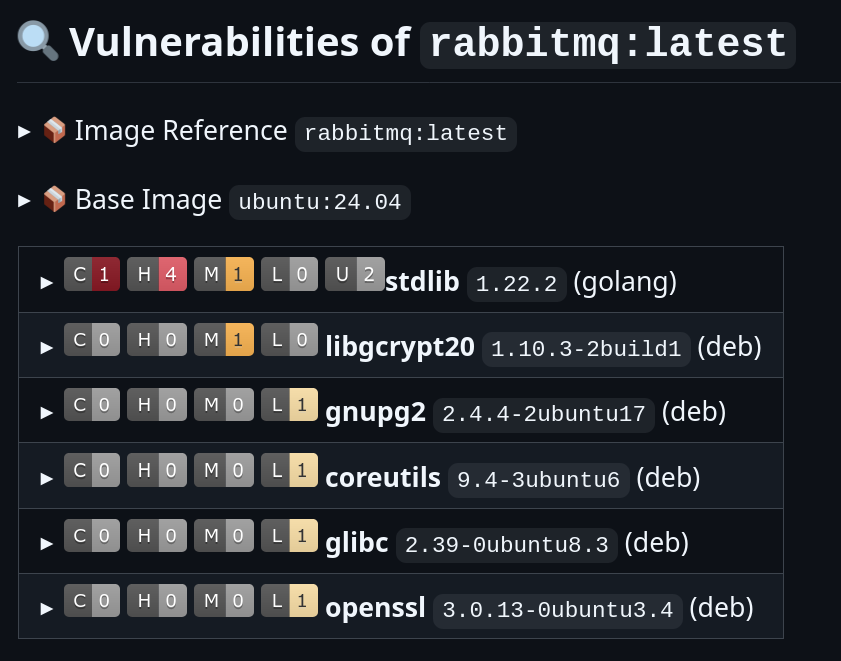
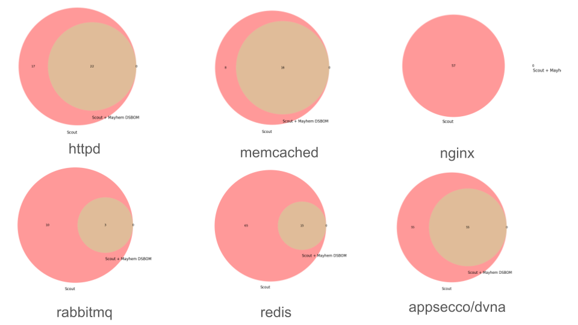

# Cut through Container Security Noise: Mayhem Dynamic SBOM and Docker Scout

Container security is critical in modern software development, and as applications grow in complexity, so too do the potential vulnerabilities lurking within them. [Docker Scout](https://docs.docker.com/scout/) is an excellent SBOM/SCA tool supported by [Docker](https://www.docker.com/), that enables teams to detect potential software vulnerabilities in any docker image they rely on - whether it is developed by them or external vendors or any other source.

While Docker Scout is great for detecting vulnerable packages, as with all SBOM/SCA tools not all issues identified are real/exposed on the attack surface. For example, if you use a `debian` image anywhere in production, you may have encountered the infamous [CVE-2011-3374 apt vuln](https://nvd.nist.gov/vuln/detail/CVE-2011-3374):

```sh
$ docker scout cves debian:latest
    ✓ Image stored for indexing
    ✓ Indexed 125 packages
    ✗ Detected 13 vulnerable packages with a total of 24 vulnerabilities
...
   0C     0H     0M     1L  apt 2.6.1
pkg:deb/debian/apt@2.6.1?os_distro=bookworm&os_name=debian&os_version=12

    ✗ LOW CVE-2011-3374
      https://scout.docker.com/v/CVE-2011-3374
      Affected range : >=2.6.1
      Fixed version  : not fixed
...
```

and you may have followed (if you haven't, consider yourself lucky) the thread that [Debian is probably not going to fix it](https://bugs.debian.org/cgi-bin/bugreport.cgi?bug=642480), which makes sense given that more than a decade has passed since it was reported. This finding is not unique. Security teams have to deal on a dialy basis with images+packages that include 10year old issues that are "won't fix" and provide reports that show these issues remediated. Worse, most likely the application you are developing *does not* involve running the package manager with an attacker controlled payload and the only reason `apt` is part of the production image is for packaging purposes (how else can we install our packages?).

What if packages that are not loaded at runtime where automatically identified and filtered out? What if Docker Scout could be even better and report only findings that are actually used by the application? Is such a thing possible? This is the topic we'll be tackling in this blog post, where we'll combine Docker Scout with the Mayhem Dynamic SBOM tool, to automatically identify findings that are observed at runtime and compare them to the total number of findings within our images.

## Why is Docker Scout Great?

If you need an SBOM/SCA solution, Docker Scout is a great option, and here's why:

* Tight and simple integration with your container runtime / stack. If you are a Docker user, installing scout is as simple as [running a curl command](https://docs.docker.com/scout/install/).
* Docker Scout provides SBOM and SCA reports in [all standardized formats including SPDX and SARIF](https://www.mayhem.security/blog/sbom-format-comparison-which-sca-sbom-format-is-best) along with all vulnerability details and severity level info most security teams need.
* Outstanding ecosystem support like the [docker scout GitHub Action](https://github.com/docker/scout-action) workflow, that is highly customizable, with an extremely easy-to-use interface and beautiful reporting that even includes remediation suggestions.



We have found that Docker Scout is a fantastic tool to work with from a UI/UX perspective. The only frustration - as with most SBOM/SCA tools - was that several of the findings were about components not observed at runtime. Can this be improved? This is what we'll look into in the next section with Mayhem Dynamic SBOM.

## Mayhem Dynamic SBOM: Building on top of Docker Scout

[Mayhem Dynamic SBOM (MDSBOM)](https://www.mayhem.security/dynamic-sbom) is an analysis tool that monitors application behavior and automatically identifies all packages and vulnerabilities that are observed at runtime. MDSBOM plugs into any SBOM/SCA tool (including Docker Scout) and enables teams to quickly identify which SBOM/SCA are actually observed.

By combining a runtime analysis tool like MDSBOM with Docker Scout, we can:

* Prioritize better. Mayhem’s dynamic analysis flags all vulnerabilities that are observed at runtime, thus enabling teams to focus on the findings that matter first.
* Reduce false alarms. By focusing on observed findings, teams know that the vulnerabilities they are looking into are reachable, and thus less likely to be false alarms.
* Eliminate dead code. Do you see a package included in your static SBOM but not in your Mayhem DSBOM? That means you have a package that is unused in production. Remove it (if you can!), save on image size and also future SBOM reports. No code is the safest code :)

Is that combination worth it though? What kind of findings reduction can we expect?

## Enough, Show me the Code / Results!

We put the MDSBOM + Docker Scout combo to the test in a [GitHub repo](https://github.com/ethan42/scout-mdsbom) to scan images and see what kind of findings reduction we can expect. We used the combo to experiment on 5 of the most popular docker images ([redis](https://hub.docker.com/_/redis), [nginx](https://hub.docker.com/_/nginx), [httpd](https://hub.docker.com/_/httpd), [rabbitmq](https://hub.docker.com/_/rabbitmq), [memcached](https://hub.docker.com/_/memcached)) as well as a known vulnerable one ([appsecco/dvna](https://github.com/appsecco/dvna)). Here's what SCA vulnerability results looked like:

| Image                | Docker Scout | Mayhem DSBOM | Reduction/Savings |
|----------------------|--------------|--------------|-----------|
| httpd:latest         | 39           | 17           |       56% |
| memcached:latest     | 24           | 8            |       67% |
| nginx:latest         | 57           | 57           |        0% |
| rabbitmq:latest      | 13           | 10           |       23% |
| redis:latest         | 80           | 65           |       19% |
| appsecco/dvna:sqlite | 110          | 55           |       50% |
| Total                | 323          | 212          |       34% |

We also used the same pipeline to visualize how many findings were observed vs non-observed according to MDSBOM:



There are two main observations we make from the above: (1) dvna (Damn Vulnerable NodeJS Application) is not that bad - according to Docker Scout, findings seem to be on par with some of the most popular images used on the internet today(!) and (2) Mayhem DSBOM detects that a significant percentage - ranging from 0% in nginx up to 67% in memcached - of all reported findings were never observed at runtime! Put another way, your team knows which 66% of findings are in code that is reachable by your application today and which 34% of findings belongs in potentially unreachable code that you can focus on removing!

Opening one of the SARIF reports for memcached, we see a familiar finding suppressed as *not observed in use at runtime*:

```json
          "message": {
            "text": "  Vulnerability   : CVE-2011-3374                                                             \n  Severity        : LOW                                                                       \n  Package         : pkg:deb/debian/apt@2.6.1?os_distro=bookworm&os_name=debian&os_version=12  \n  Affected range  : >=2.6.1                                                                   \n  Fixed version   : not fixed                                                                 \n  EPSS Score      : 0.001640                                                                  \n  EPSS Percentile : 0.535910                                                                  \n"
          },
          "ruleId": "CVE-2011-3374",
          "ruleIndex": 4,
          "suppressions": [
            {
              "justification": "The vulnerable component(s) have not been observed in use at runtime.",
              "kind": "external",
              "status": "underReview"
            }
          ]
```

This makes sense, default memcached should not invoke `apt` and runtime and MDSBOM was able to capture that behavior automatically!

## Conclusion

Docker Scout is a fantastic tool for enhancing your container security posture, but why settle for fantastic when you can do even better? By integrating Mayhem Dynamic SBOM, you can cut through the noise and focus on the issues that truly matter. Achieving a 35% reduction in findings means fewer distractions, faster release cycles, leaner images and more stable deployments.

All code used above is [available on GitHub](https://github.com/ethan42/scout-mdsbom) - see something off? Send us a PR! Or give Docker Scout and Mayhem Dynamic SBOM a try on your images and let us know how it performed!
